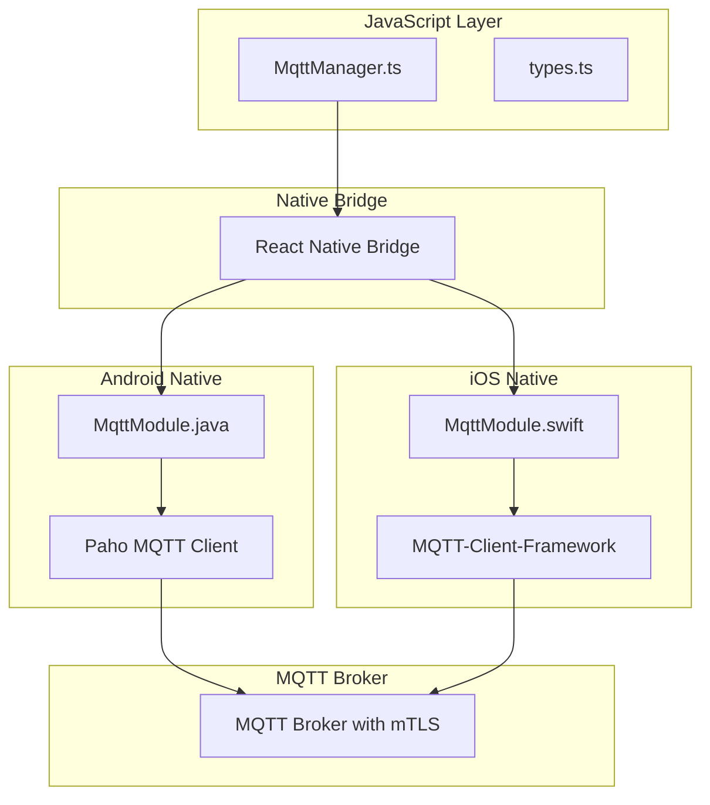
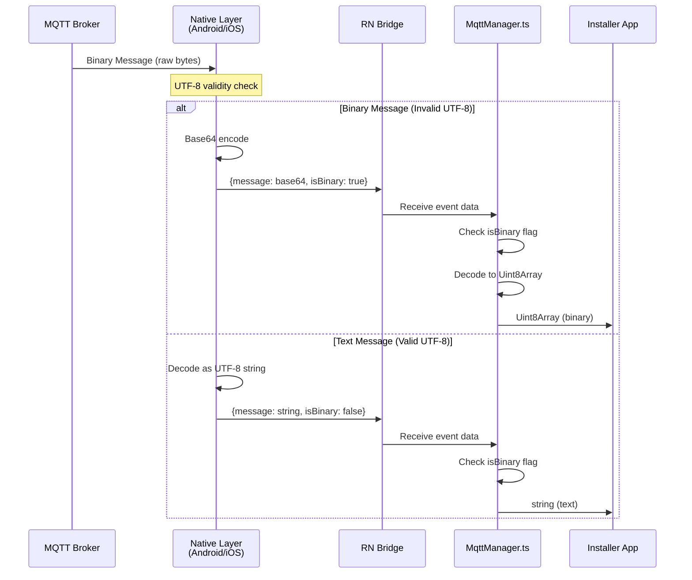
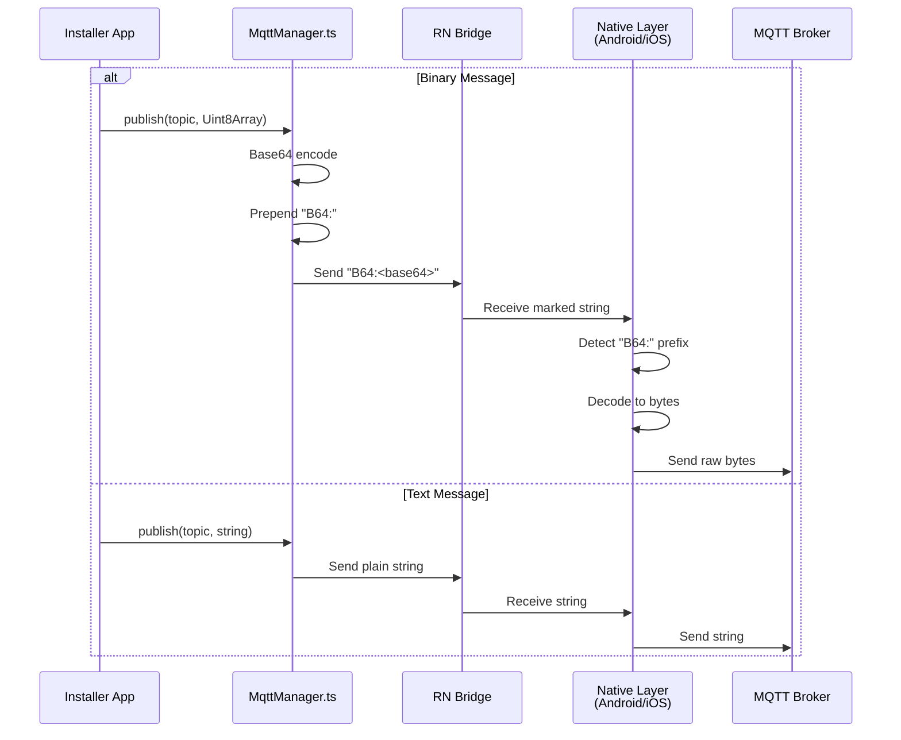
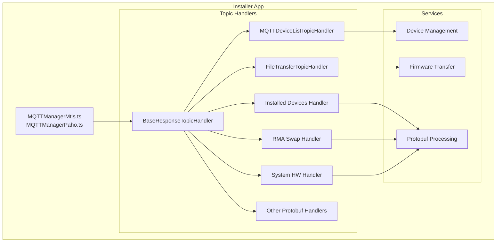
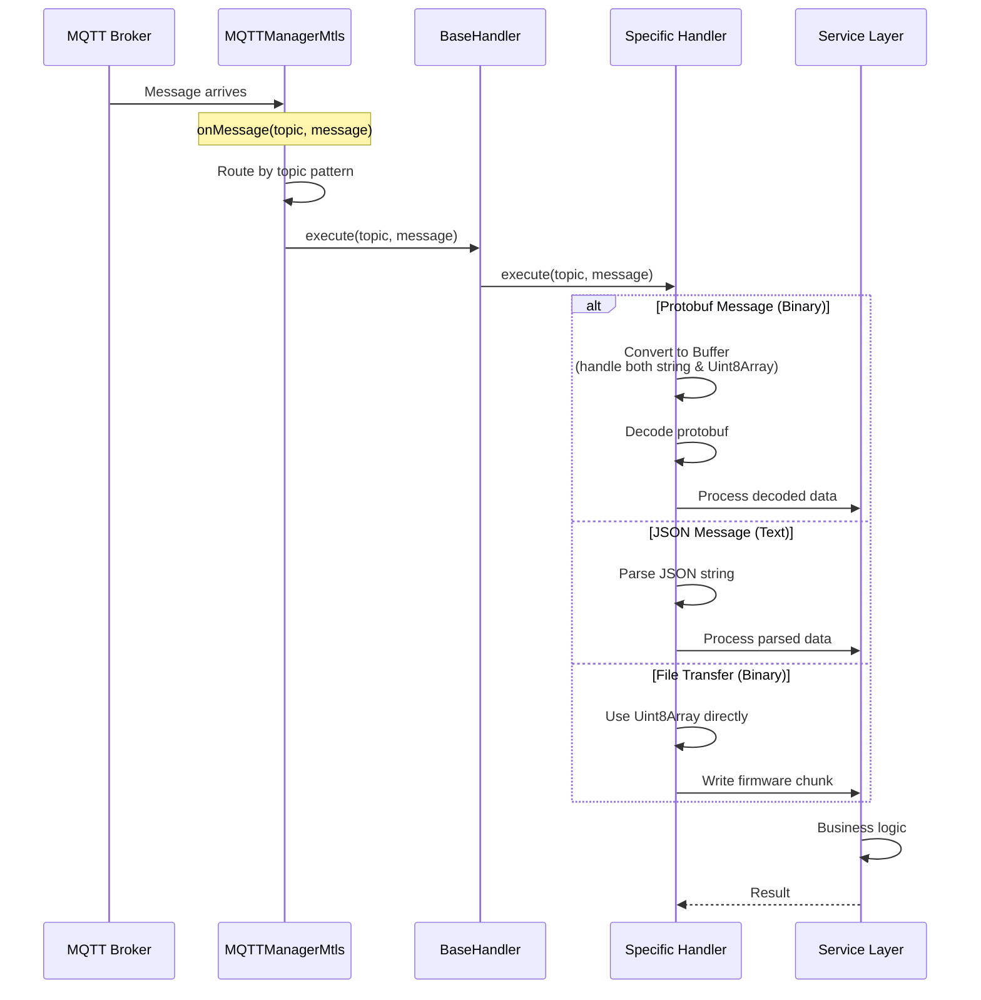
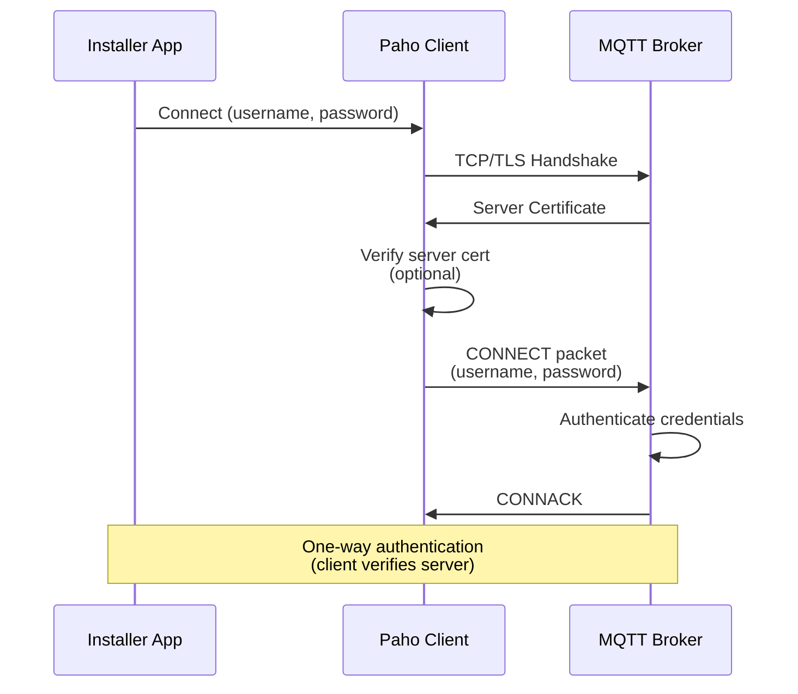
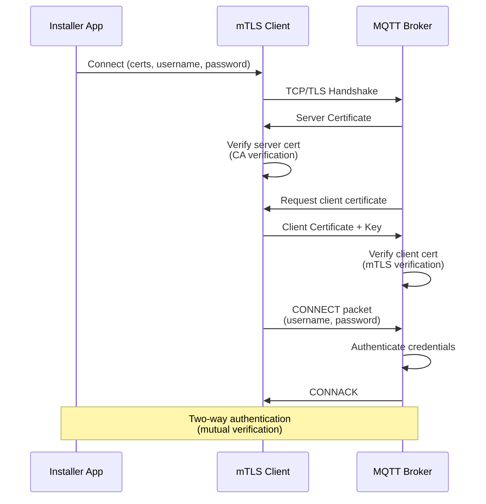
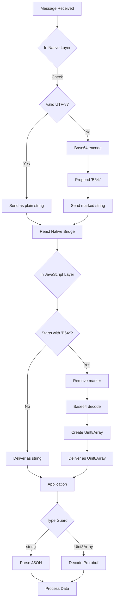

# MQTT Architecture: mTLS Package & Installer App

## Table of Contents
1. [Overview](#overview)
2. [MQTT mTLS Package Architecture](#mqtt-mtls-package-architecture)
3. [Installer App Integration](#installer-app-integration)
4. [Paho vs MQTT mTLS Comparison](#paho-vs-mqtt-mtls-comparison)
5. [Binary Message Handling](#binary-message-handling)
6. [Recent Changes & Improvements](#recent-changes--improvements)

---

## Overview

This document explains the architecture and data flow between the `react-native-mqtt-mtls` package and the installer app, covering both the legacy Paho MQTT implementation and the new mTLS-enabled implementation.

### Key Components
- **react-native-mqtt-mtls**: Native React Native module providing MQTT connectivity with mTLS support
- **Installer App**: Consumer application handling device management, firmware transfers, and protobuf message processing
- **Native Layers**: Android (Java) and iOS (Swift) implementations

---

## MQTT mTLS Package Architecture

### High-Level Architecture



### Core Components

#### 1. MqttManager.ts (JavaScript Layer)
- **Purpose**: Main interface for MQTT operations in React Native apps
- **Key Features**:
  - Connection management (connect, disconnect, reconnect)
  - Message publishing (text and binary)
  - Topic subscription/unsubscription
  - Event handling (onMessage, onConnectionChange, onError)
  - Binary message detection and handling

```typescript
// Key Type Definitions
interface MqttMessage {
  topic: string;
  message: string | Uint8Array;  // Binary messages as Uint8Array
  qos: 0 | 1 | 2;
  retained: boolean;
}

interface MqttConfig {
  clientId: string;
  host: string;
  port: number;
  protocol: 'tcp' | 'ssl' | 'ws' | 'wss';
  username?: string;
  password?: string;
  keepAlive?: number;
  cleanSession?: boolean;
  // mTLS specific
  certPath?: string;
  keyPath?: string;
  caPath?: string;
}
```

#### 2. Native Modules (Android & iOS)

**Common Features**:
- mTLS certificate handling (client cert, private key, CA cert)
- Binary message encoding/decoding with `B64:` marker
- Connection state management
- Message delivery with QoS support

**Binary Message Marker**:
```java
// Android (MqttModule.java)
private static final String BINARY_MARKER = "B64:";

// iOS (MqttModule.swift)
private static let BINARY_MARKER = "B64:"
```

### Message Flow: Broker → App (Receiving Messages)



**Key Steps**:
1. **Native Layer**: Receives raw bytes from broker
2. **Binary Detection**: Checks if payload is valid UTF-8 (protobuf uses varint encoding → invalid UTF-8)
3. **Encoding**: Base64 encodes binary data, sends with `isBinary: true` flag
4. **Transport**: Sends through React Native bridge as event with message + flag
5. **JavaScript Layer**: Checks `isBinary` flag, decodes Base64 to `Uint8Array` if binary
6. **Application**: Receives properly typed message

**Note**: The receive path uses an `isBinary` flag rather than the `B64:` prefix used in publishing.
This asymmetry allows the receiver to handle messages from any publisher, regardless of whether
they use the `B64:` convention.

### Message Flow: App → Broker (Publishing Messages)



---

## Installer App Integration

### Architecture Overview



### MQTTManager Implementations

The installer app has **two implementations**:

#### 1. MQTTManagerPaho.ts (Legacy)
```typescript
// Uses react-native-paho-mqtt (no mTLS support)
import { MQTTClient } from 'react-native-paho-mqtt';

class MQTTManagerPaho {
  connect(config: MqttConfig) {
    // Standard MQTT connection (username/password only)
  }
  
  subscribe(topic: string) {
    // Subscribe to topics
  }
  
  // Message handling: Only supports text messages
  onMessageArrived(message: Message) {
    const payload = message.payloadString;  // Always string
    this.handleMessage(topic, payload);
  }
}
```

#### 2. MQTTManagerMtls.ts (New)
```typescript
// Uses react-native-mqtt-mtls (with mTLS support)
import { MqttManager } from 'react-native-mqtt-mtls';

class MQTTManagerMtls {
  connect(config: MqttConfig & MtlsConfig) {
    // mTLS connection with client certificates
    MqttManager.connect({
      ...config,
      certPath: '/path/to/client.crt',
      keyPath: '/path/to/client.key',
      caPath: '/path/to/ca.crt'
    });
  }
  
  // Message handling: Supports both text and binary
  onMessage(topic: string, message: string | Uint8Array) {
    this.handleMessage(topic, message);  // Passes through type
  }
}
```

### Topic Handler Pattern

All message handlers follow a consistent pattern:

```typescript
abstract class BaseResponseTopicHandler {
  // Updated to handle both string and Uint8Array
  abstract execute(topic: string, message: string | Uint8Array): void;
  
  protected handleMessage(topic: string, message: string | Uint8Array): void {
    // Type guard and processing logic
  }
}
```

### Handler Types

#### A. Text-Based Handlers (JSON Messages)
```typescript
class DeviceListHandler extends BaseResponseTopicHandler {
  execute(topic: string, message: string | Uint8Array): void {
    // Expects JSON string
    if (typeof message !== 'string') {
      console.warn('Expected string message');
      return;
    }
    
    const devices = JSON.parse(message);
    this.processDevices(devices);
  }
}
```

#### B. Binary Handlers (Protobuf Messages)
```typescript
class MQTTDeviceListTopicHandler extends BaseResponseTopicHandler {
  execute(topic: string, message: string | Uint8Array): void {
    // Handle both formats for backward compatibility
    const buf = typeof message === 'string'
      ? Buffer.from(message, 'hex')  // Legacy: hex-encoded string
      : Buffer.from(message);         // New: Uint8Array from native layer
    
    // Decode protobuf
    const response = DeviceListResponse.decode(new Uint8Array(buf));
    this.processDevices(response);
  }
}
```

#### C. File Transfer Handler (Binary Files)
```typescript
class FileTransferTopicHandler extends BaseResponseTopicHandler {
  execute(topic: string, message: string | Uint8Array): void {
    // Expects binary data
    if (typeof message === 'string') {
      console.warn('File transfer expects binary data');
      return;
    }
    
    // message is Uint8Array - can be used directly
    this.processFirmwareChunk(message);
  }
}
```

### Message Processing Flow



---

## Paho vs MQTT mTLS Comparison

### Feature Comparison Table

| Feature | Paho MQTT | MQTT mTLS |
|---------|-----------|-----------|
| **Security** | Username/Password | mTLS (Mutual TLS) + Username/Password |
| **Client Authentication** | Password only | Client certificate + Private key |
| **Server Verification** | Basic SSL/TLS | CA certificate verification |
| **Binary Messages** | Limited (manual encoding) | Native support with Uint8Array |
| **Message Size Limit** | Bridge limitations | Efficient (no hex overhead) |
| **Platform Support** | Android/iOS | Android/iOS |
| **Maintenance** | Community | Active (generacclean) |
| **Use Case** | Standard MQTT | Enterprise, IoT with security requirements |

### Security Architecture Comparison

#### Paho MQTT (Standard TLS)


#### MQTT mTLS (Mutual TLS)


### Configuration Comparison

#### Paho Configuration
```typescript
// MQTTManagerPaho.ts
const config = {
  clientId: 'installer-app-001',
  host: 'mqtt.example.com',
  port: 8883,
  protocol: 'ssl',
  username: 'app_user',
  password: 'secret_password',
  keepAlive: 60,
  cleanSession: true
};

// No certificate configuration
await MQTTClient.connect(config);
```

#### mTLS Configuration
```typescript
// MQTTManagerMtls.ts
const config = {
  clientId: 'installer-app-001',
  host: 'mqtt.example.com',
  port: 8883,
  protocol: 'ssl',
  username: 'app_user',
  password: 'secret_password',
  keepAlive: 60,
  cleanSession: true,
  
  // mTLS specific (THREE certificates required)
  certPath: '/app/certs/client.crt',      // Client certificate
  keyPath: '/app/certs/client.key',       // Client private key
  caPath: '/app/certs/ca.crt'            // Certificate Authority
};

await MqttManager.connect(config);
```

### Binary Message Handling Comparison

#### Paho (Manual Encoding)
```typescript
// In Paho, you must manually handle binary data

// Sending binary (protobuf)
const protoMessage = DeviceListRequest.encode(data).finish();
const hexString = Buffer.from(protoMessage).toString('hex');
await MQTTClient.publish(topic, hexString, qos, retained);

// Receiving binary
onMessageArrived(message: Message) {
  const hexString = message.payloadString;  // Always string
  const buffer = Buffer.from(hexString, 'hex');  // Manual conversion
  const decoded = DeviceListResponse.decode(buffer);
}
```

#### mTLS (Native Binary Support)
```typescript
// In mTLS, binary data is handled natively

// Sending binary (protobuf)
const protoMessage = DeviceListRequest.encode(data).finish();
await MqttManager.publish(topic, protoMessage, qos, retained);  // Direct

// Receiving binary
MqttManager.onMessage((topic, message) => {
  if (typeof message !== 'string') {
    // message is Uint8Array - use directly
    const decoded = DeviceListResponse.decode(message);
  }
});
```

---

## Binary Message Handling

### The Challenge: React Native Bridge Limitation

The React Native bridge **only supports string primitives** for native-to-JS communication. Binary data must be encoded for transport.

### Solution: Binary Flag Protocol (Receive) & B64 Marker (Publish)

#### Encoding Strategy

**Receive Path** (Broker → App):
- Native detects binary via UTF-8 validity check
- Sends Base64-encoded message with `isBinary` flag
- JavaScript layer checks flag to decode correctly

**Publish Path** (App → Broker):
- JavaScript adds `B64:` prefix to binary messages
- Native detects prefix, strips it, decodes Base64 to raw bytes
- Sends raw bytes to broker

#### Implementation Details

##### 1. Native Layer (Android) - Receive
```java
// MqttModule.java
private boolean isBinaryData(byte[] payload) {
    try {
        CharsetDecoder decoder = StandardCharsets.UTF_8.newDecoder();
        decoder.onMalformedInput(CodingErrorAction.REPORT);
        decoder.onUnmappableCharacter(CodingErrorAction.REPORT);
        decoder.decode(ByteBuffer.wrap(payload));
        return false;  // Successfully decoded as UTF-8 → text
    } catch (CharacterCodingException e) {
        return true;  // Not valid UTF-8 → binary
    }
}

@Override
public void messageArrived(String topic, MqttMessage message) {
    byte[] payload = message.getPayload();
    boolean isBinary = isBinaryData(payload);
    
    WritableMap eventData = Arguments.createMap();
    eventData.putString("topic", topic);
    
    if (isBinary) {
        // Binary: Base64 encode for bridge transport
        String payloadBase64 = Base64.encodeToString(payload, Base64.NO_WRAP);
        eventData.putString("message", payloadBase64);
        eventData.putBoolean("isBinary", true);
    } else {
        // Text: Send as UTF-8 string
        String messageStr = new String(payload, StandardCharsets.UTF_8);
        eventData.putString("message", messageStr);
        eventData.putBoolean("isBinary", false);
    }
    
    reactContext.getJSModule(DeviceEventManagerModule.RCTDeviceEventEmitter.class)
               .emit("MqttMessage", eventData);
}
```

##### 2. Native Layer (iOS) - Receive
```swift
// MqttModule.swift
private func isBinaryData(_ data: Data) -> Bool {
    return String(data: data, encoding: .utf8) == nil
}

func mqtt(_ mqtt: CocoaMQTT, didReceiveMessage message: CocoaMQTTMessage, id: UInt16) {
    let payloadData = Data(message.payload)
    let isBinary = self.isBinaryData(payloadData)
    
    var eventBody: [String: Any] = [
        "topic": message.topic,
        "qos": message.qos.rawValue
    ]
    
    if isBinary {
        // Binary: Base64 encode for bridge transport
        let payloadBase64 = payloadData.base64EncodedString()
        eventBody["message"] = payloadBase64
        eventBody["isBinary"] = true
    } else {
        // Text: Send as UTF-8 string
        if let messageStr = String(data: payloadData, encoding: .utf8) {
            eventBody["message"] = messageStr
            eventBody["isBinary"] = false
        }
    }
    
    self.sendEvent(withName: "MqttMessage", body: eventBody)
}
```

##### 3. JavaScript Layer - Receive
```typescript
// MqttManager.ts
private handleMessage(parsedData: any): void {
  let processedMessage: string | Uint8Array;
  
  if (parsedData.isBinary) {
    // Binary message: Decode from Base64
    const base64Data = parsedData.message;
    const binaryString = atob(base64Data);
    const bytes = new Uint8Array(binaryString.length);
    
    for (let i = 0; i < binaryString.length; i++) {
      bytes[i] = binaryString.charCodeAt(i);
    }
    
    processedMessage = bytes;  // Uint8Array
  } else {
    // Text message: Use as-is
    processedMessage = parsedData.message;  // string
  }
  
  this.messageCallback?.(topic, processedMessage);
}
```

##### 4. JavaScript Layer - Publish
```typescript
// MqttManager.ts - Publish path uses B64: marker
const BINARY_MARKER = "B64:";

publish(topic: string, message: string | Uint8Array, ...): Promise<void> {
  let publishMessage = message;
  
  if (message instanceof Uint8Array || message instanceof ArrayBuffer) {
    const bytes = message instanceof ArrayBuffer 
      ? new Uint8Array(message) 
      : message;
    
    // Convert to Base64 and add B64: marker
    let binary = "";
    for (let i = 0; i < bytes.byteLength; i++) {
      binary += String.fromCharCode(bytes[i]);
    }
    publishMessage = BINARY_MARKER + btoa(binary);
  }
  
  // Send to native layer (which will detect B64: prefix and decode)
  MqttModule.publish(topic, publishMessage, qos, retained, ...);
}
```

**Note on Asymmetry**: The publish path adds a `B64:` prefix to signal binary intent on the wire, 
while the receive path uses an `isBinary` flag based on UTF-8 validity. This design allows the 
receiver to handle messages from any publisher, regardless of encoding convention.

### Data Flow Diagram - Receive Path

```mermaid
graph LR
    subgraph "Native Layer"
        A[Raw Bytes]
        B{UTF-8<br/>Valid?}
        C[UTF-8 String]
        D[Base64 Encode]
    end
    
    subgraph "Bridge Transport"
        F[Event: {message, isBinary}]
    end
    
    subgraph "JavaScript Layer"
        G{isBinary<br/>flag?}
        H[Use as Text]
        J[Base64 Decode]
        K[Uint8Array]
    end
    
    subgraph "Application"
        L[string]
        M[Uint8Array]
    end
    
    A --> B
    B -->|Yes - Text| C
    B -->|No - Binary| D
    C --> F
    D --> F
    F --> G
    G -->|false| H
    G -->|true| J
    J --> K
    H --> L
    K --> M
```

### Memory & Performance Impact

#### Before: Hex Encoding (Legacy Approach)
```
Original Binary: 143 MB (firmware file)
Hex Encoded:     286 MB (2x size: each byte → 2 hex chars)
Memory Usage:    3x (original + hex + parsed)
```

#### After: Base64 with Uint8Array
```
Original Binary: 143 MB (firmware file)
Base64 Encoded:  191 MB (1.33x size: 4 chars per 3 bytes)
Memory Usage:    2x (original + base64, Uint8Array shares buffer)
```

**Improvements**:
- ✅ 33% reduction in encoded size (286 MB → 191 MB)
- ✅ 50% reduction in total memory usage
- ✅ Faster encode/decode (Base64 optimized in native code)
- ✅ Proper type safety (Uint8Array vs string)

---

## Recent Changes & Improvements

### Problem Statement

**Issue #1: Firmware Transfer Bug**
- Firmware files (143 MB) were being hex-encoded to 286 MB strings
- `TextDecoder` expected `Uint8Array`, but received hex strings
- Transfer failed or consumed excessive memory

**Issue #2: Type Inconsistency**
- PR review flagged breaking change: message type changed from `string` to `string | ArrayBuffer`
- Consumer apps expected specific types for different message formats

**Issue #3: Code Duplication**
- `BINARY_MARKER` defined as string literals in multiple places
- Prefix length calculated incorrectly (counted chars instead of bytes in some places)

### Solution Overview

#### 1. Standardized Binary Marker as Constant

**Changed Files**: `MqttManager.ts`, `MqttModule.java`, `MqttModule.swift`

```diff
// Before (all three files)
- if (message.startsWith("B64:")) {
-   const base64Data = message.substring(4);
+ const BINARY_MARKER = "B64:";
+ if (message.startsWith(BINARY_MARKER)) {
+   const base64Data = message.substring(BINARY_MARKER.length);
```

**Benefits**:
- Single source of truth
- Consistent prefix length calculation
- Easier to change marker format in future

#### 2. Changed Binary Format: Uint8Array (Not ArrayBuffer)

**Rationale**:
- `Uint8Array` is the standard for binary data in JavaScript
- More ergonomic API (`.length`, `.slice()`, `.set()`)
- Compatible with `TextDecoder`, `Buffer.from()`, and protobuf libraries
- Can be created from `ArrayBuffer`: `new Uint8Array(arrayBuffer)`

**Changed Files**: `MqttManager.ts`, `types.ts`

```diff
// types.ts
export interface MqttMessage {
  topic: string;
- message: string | ArrayBuffer;
+ message: string | Uint8Array;
  qos: 0 | 1 | 2;
  retained: boolean;
}

// MqttManager.ts
- let processedMessage: string | ArrayBuffer;
+ let processedMessage: string | Uint8Array;

if (message.startsWith(BINARY_MARKER)) {
  const base64Data = message.substring(BINARY_MARKER.length);
  const binaryString = atob(base64Data);
  const bytes = new Uint8Array(binaryString.length);
  
  for (let i = 0; i < binaryString.length; i++) {
    bytes[i] = binaryString.charCodeAt(i);
  }
  
- processedMessage = bytes.buffer;  // ❌ ArrayBuffer
+ processedMessage = bytes;          // ✅ Uint8Array
}
```

#### 3. Updated Consumer App Handlers (Backward Compatible)

**Changed Files**: 6 protobuf handlers + `BaseResponseTopicHandler.ts`

**Pattern Applied**:
```typescript
// Before
execute(topic: string, message: string): void {
  const buf = Buffer.from(message, 'hex');  // Assumed hex string
  const decoded = ProtoMessage.decode(buf);
}

// After (handles both formats)
execute(topic: string, message: string | Uint8Array): void {
  const buf = typeof message === 'string'
    ? Buffer.from(message, 'hex')  // Legacy: hex-encoded string
    : Buffer.from(message);         // New: Uint8Array from native layer
  
  const decoded = ProtoMessage.decode(buf);
}
```

**Updated Handlers**:
1. `MQTTDeviceListTopicHandler.ts`
2. `MQTTDeviceListBroadcastTopicHandler.ts`
3. `MQTTInstalledDevicesSuccessListTopicHandler.ts`
4. `MQTTInstalledDevicesErrorTopicHandler.ts`
5. `MQTTRmaSwapResponseTopicHandler.ts`
6. `MQTTSystemHwAssemblyResponseTopicHandler.ts`

#### 4. No Changes Required

**Files that work as-is**:
- ✅ `MQTTManagerMtls.ts` - Passes messages through without inspection
- ✅ `FileTransferTopicHandler.ts` - Already expects `ArrayBuffer`, `Uint8Array` is compatible

### Change Summary Table

| Component | Change Type | Files Modified | Lines Changed |
|-----------|-------------|----------------|---------------|
| **Library** | Binary marker constant | 3 files | ~12 lines |
| **Library** | Binary format: Uint8Array | 2 files | ~8 lines |
| **Library** | Removed temp files | 2 files | Deleted |
| **Consumer App** | Base handler signature | 1 file | ~4 lines |
| **Consumer App** | Protobuf handlers | 6 files | ~18 lines |
| **Total** | | **14 files** | **~42 lines** |

### Testing Checklist

#### Library (react-native-mqtt-mtls)
- [ ] Binary messages decoded correctly to `Uint8Array`
- [ ] Text messages received as `string`
- [ ] `BINARY_MARKER` constant used consistently
- [ ] No performance regression on large messages

#### Installer App
- [ ] Firmware transfers work (143 MB files)
- [ ] Protobuf messages decode correctly
- [ ] JSON messages parse correctly
- [ ] No crashes with mixed message types
- [ ] Backward compatibility with legacy messages

### Benefits Recap

1. **✅ Fixes firmware transfer bug**
   - `TextDecoder` receives correct type (`Uint8Array`)
   - No hex conversion overhead

2. **✅ 50% memory savings**
   - 143 MB binary → 191 MB base64 (was 286 MB hex)
   - Reduced memory pressure on mobile devices

3. **✅ Cleaner, more idiomatic types**
   - `Uint8Array` is the standard for binary data
   - Better TypeScript support and autocomplete

4. **✅ Backward compatible**
   - Handlers check message type and adapt
   - Legacy hex-encoded messages still supported

5. **✅ Addresses PR concerns**
   - Breaking change handled at consumer level
   - Library provides clean, typed API
   - Consumer apps adapt gradually

6. **✅ Proper architecture**
   - Library handles encoding/decoding complexity
   - Consumer apps work with typed data
   - Clear separation of concerns

---

## Appendix: Message Type Detection Flow



---

## Summary

### Architecture Principles

1. **Security First**: mTLS provides enterprise-grade security with mutual authentication
2. **Type Safety**: Proper types (`string | Uint8Array`) throughout the stack
3. **Efficiency**: Base64 encoding minimizes memory overhead vs hex encoding
4. **Backward Compatibility**: Consumer apps handle both old and new message formats
5. **Separation of Concerns**: Library handles encoding, apps handle business logic

### Key Takeaways

- **MQTT mTLS Package**: Native binary support with mTLS security
- **Installer App**: Topic-based routing with type-safe handlers
- **Binary Protocol**: `B64:` marker enables efficient binary transport
- **Migration Path**: Gradual adoption without breaking existing functionality

---

**Document Version**: 1.0  
**Last Updated**: July 2026  
**Maintained By**: Ved Yedla (generacclean)
