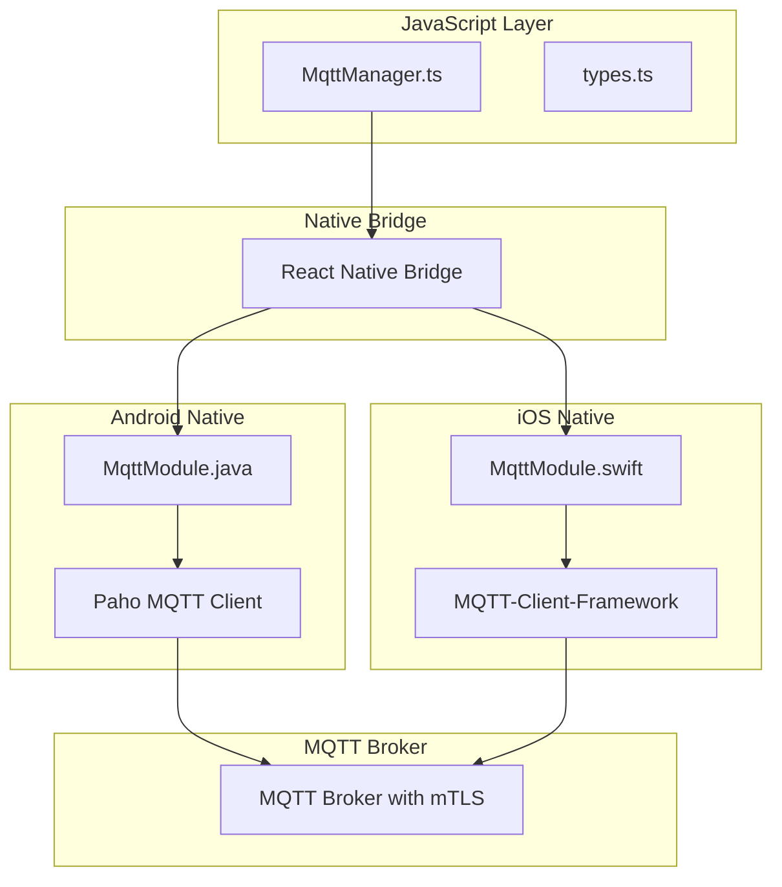
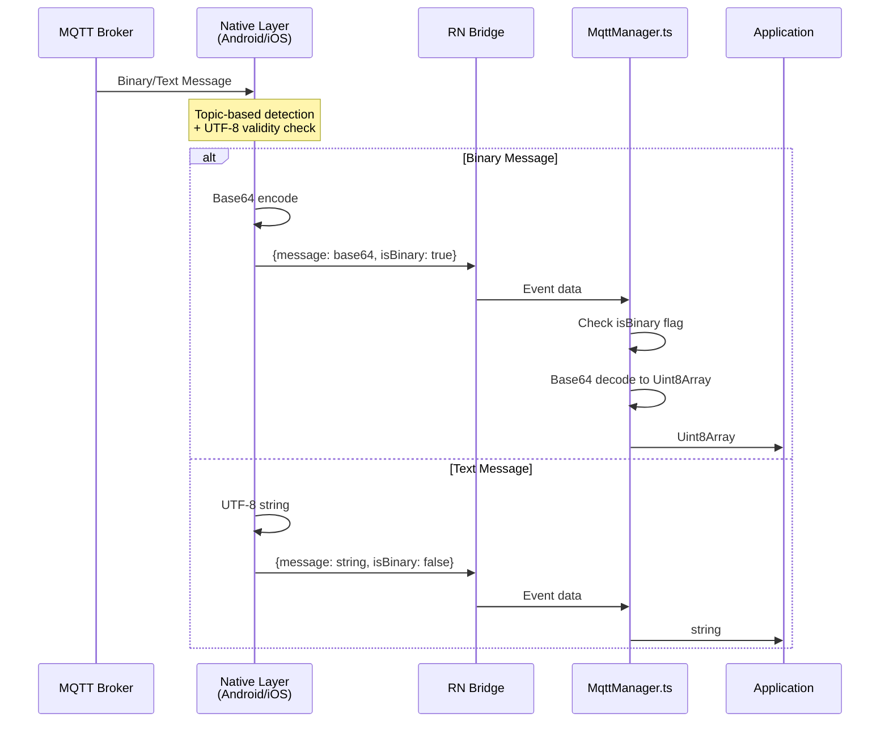
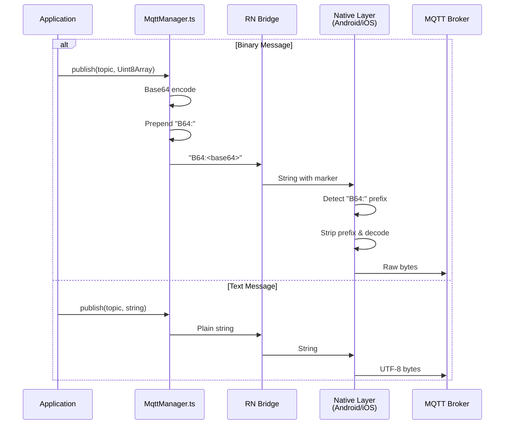

# MQTT mTLS Library Architecture

## Table of Contents
1. [Overview](#overview)
2. [Core Architecture](#core-architecture)
3. [Message Flow](#message-flow)
4. [Binary Message Handling](#binary-message-handling)
5. [Type Definitions](#type-definitions)
6. [Binary Detection Strategy](#binary-detection-strategy)

---

## Overview

`react-native-mqtt-mtls` is a React Native library providing MQTT connectivity with mutual TLS (mTLS) support for Android and iOS. The library handles binary and text message transport across the React Native bridge.

### Key Features
- mTLS certificate-based authentication
- Binary and text message support
- Automatic message type detection (topic-based + UTF-8 heuristic)
- Callback double-invocation protection
- Type-safe TypeScript API

---

## Core Architecture



### Components

#### 1. MqttManager.ts (JavaScript Layer)
Main interface for MQTT operations:
- Connection management (connect, disconnect, reconnect)
- Message publishing (text and binary)
- Topic subscription/unsubscription
- Event handling (onMessage, onConnectionChange, onError)

#### 2. Native Modules (Android & iOS)
Platform-specific implementations:
- mTLS certificate handling (client cert, private key, CA cert)
- Binary message detection and encoding
- Connection state management
- Message delivery with QoS support

#### 3. Binary Message Marker
Cross-platform constant for publish path:
```java
// Android (MqttModule.java)
private static final String BINARY_MARKER = "B64:";

// iOS (MqttModule.swift)
private static let BINARY_MARKER = "B64:"

// JavaScript (MqttManager.ts)
const BINARY_MARKER = 'B64:';
```

---

## Message Flow

### Receiving Messages (Broker → App)



**Receive Path Strategy**:
1. **Topic-based detection** (deterministic): Known binary/text topics are classified by pattern
2. **UTF-8 validity check** (fallback): Unknown topics are classified by content inspection
3. **Flag-based transport**: `isBinary` boolean flag signals type to JavaScript layer
4. **Type preservation**: Binary messages delivered as `Uint8Array`, text as `string`

### Publishing Messages (App → Broker)



**Publish Path Strategy**:
- Uses `B64:` prefix to signal binary intent
- Allows downstream systems (broker, other subscribers) to detect binary format
- Native layer strips prefix and decodes before transmission

**Design Note**: Publish and receive use different mechanisms (prefix vs. flag) intentionally:
- **Publish**: Prefix travels on the wire, signals intent to any subscriber
- **Receive**: Flag is library-internal, handles messages from any publisher (not just our app)

---

## Binary Message Handling

### The Challenge
The legacy React Native bridge serializes all data as JSON, preventing direct binary buffer transport. This requires encoding binary data as strings for cross-bridge communication.

### Solution: Asymmetric Encoding

#### Publish Path (JS → Native → Broker)
```typescript
// JavaScript
const binaryData = new Uint8Array([...]);
const base64 = Buffer.from(binaryData).toString('base64');
const marked = `B64:${base64}`;
// Send to native layer

// Native detects prefix, strips, decodes, publishes raw bytes
```

#### Receive Path (Broker → Native → JS)
```java
// Native Android
byte[] payload = message.getPayload();
boolean isBinary = isBinaryData(topic, payload);

if (isBinary) {
    String base64 = Base64.encodeToString(payload);
    eventData.putString("message", base64);
    eventData.putBoolean("isBinary", true);
} else {
    String text = new String(payload, UTF_8);
    eventData.putString("message", text);
    eventData.putBoolean("isBinary", false);
}

// JavaScript checks flag and decodes accordingly
```

### Memory & Performance

| Approach | Memory Overhead | Bridge Payload | Decode Cost |
|----------|----------------|----------------|-------------|
| Hex encoding | 2× | Very large | Low |
| Base64 + Uint8Array | 1.33× | Moderate | Low |

Base64 with `Uint8Array` provides good balance of compatibility and efficiency.

---

## Type Definitions

```typescript
// index.d.ts and src/types.ts

export interface MqttMessage {
  topic: string;
  message: string | Uint8Array;  // Binary as Uint8Array, text as string
  qos: 0 | 1 | 2;
  retained: boolean;
  isBinary?: boolean;  // Internal flag from native layer
}

export interface MqttConfig {
  clientId: string;
  host: string;
  port: number;
  protocol: 'tcp' | 'ssl' | 'ws' | 'wss';
  username?: string;
  password?: string;
  keepAlive?: number;
  cleanSession?: boolean;
  // mTLS specific
  certPath?: string;
  keyPath?: string;
  caPath?: string;
}

export interface MqttConnectionState {
  isConnected: boolean;
  broker: string;
  clientId: string;
}
```

**Important**: The `message` field is typed as `string | Uint8Array`, not `ArrayBuffer`. This matches the runtime behavior and provides better ergonomics (`.length`, `.slice()`, direct `Buffer.from()` support).

---

## Binary Detection Strategy

### Topic-Based Detection (Deterministic)

The library uses topic patterns to deterministically classify known message types:

#### Binary Topics
- `/proto/*` - Protobuf messages
- `/device*` - Device list/status messages
- `/rma*` - RMA swap messages
- `/assembly*` - Hardware assembly messages
- `/installed*` - Installed devices messages
- `/firmware*` - Firmware update payloads
- `/ota*` - Over-the-air update messages
- `/upload*` - File upload messages

#### Text Topics
- `/status*` - JSON status messages
- `/config*` - Configuration JSON
- `/command*` - Command messages
- `/json*` - Explicit JSON messages

### UTF-8 Heuristic (Fallback)

For topics not matching known patterns, the library attempts UTF-8 decoding:
- **Valid UTF-8** → Treat as text (`isBinary: false`)
- **Invalid UTF-8** → Treat as binary (`isBinary: true`)

**Warning**: Small protobuf messages with all ASCII bytes can be valid UTF-8, causing misclassification. Topic-based detection prevents this for known message types.

### Implementation

```java
// Android (MqttModule.java)
private boolean isBinaryData(String topic, byte[] payload) {
    // Check topic patterns first (deterministic)
    if (topic != null) {
        if (topic.contains("/proto/") || topic.contains("/device") || ...) {
            return true;  // Known binary topic
        }
        if (topic.contains("/status") || topic.contains("/json") || ...) {
            return false;  // Known text topic
        }
    }
    
    // Fallback to UTF-8 validity check
    try {
        CharsetDecoder decoder = StandardCharsets.UTF_8.newDecoder();
        decoder.onMalformedInput(CodingErrorAction.REPORT);
        decoder.decode(ByteBuffer.wrap(payload));
        return false;  // Valid UTF-8 → text
    } catch (CharacterCodingException e) {
        return true;  // Invalid UTF-8 → binary
    }
}
```

```swift
// iOS (MqttModule.swift)
private func isBinaryData(topic: String, data: Data) -> Bool {
    // Topic-based detection
    if topic.contains("/proto/") || topic.contains("/device") || ... {
        return true
    }
    if topic.contains("/status") || topic.contains("/json") || ... {
        return false
    }
    
    // Fallback to UTF-8 check
    return String(data: data, encoding: .utf8) == nil
}
```

### Extending Topic Patterns

To add new topic patterns for your application:

1. **Android**: Edit `MqttModule.java`, update `isBinaryData()` method
2. **iOS**: Edit `MqttModule.swift`, update `isBinaryData()` method
3. Keep patterns synchronized across both platforms

---

## Callback Safety

### Double-Invocation Protection

The library prevents React Native bridge crashes from callback double-invocation using atomic guards:

#### Android (`MqttModule.java`)
```java
private void safeInvoke(Callback callback, AtomicBoolean fired, Object... args) {
    if (callback == null) return;
    
    if (fired.compareAndSet(false, true)) {
        callback.invoke(args);
    } else {
        Log.w(TAG, "Suppressed duplicate callback invocation");
    }
}
```

#### iOS (`MqttModule.swift`)
```swift
private class CallbackGuard {
    private var callback: RCTResponseSenderBlock?
    private var hasFired = false
    private let lock = NSLock()
    
    func invoke(_ args: [Any]) {
        lock.lock()
        defer { lock.unlock() }
        
        guard !hasFired, let callback = callback else {
            return
        }
        
        hasFired = true
        self.callback = nil
        callback(args)
    }
}
```

**Connect Callbacks**: iOS uses shared settled state to ensure success and error callbacks are mutually exclusive (matching Android's behavior).

---

## Integration Example

```typescript
import MqttManager from '@generacclean/react-native-mqtt-mtls';

// Initialize
const mqtt = new MqttManager();

// Connect with mTLS
await mqtt.connect({
  clientId: 'my-device-001',
  host: 'mqtt.example.com',
  port: 8883,
  protocol: 'ssl',
  certPath: '/path/to/client-cert.pem',
  keyPath: '/path/to/private-key.pem',
  caPath: '/path/to/ca-cert.pem'
});

// Subscribe and handle messages
mqtt.onMessage((message) => {
  if (message.isBinary) {
    // message.message is Uint8Array
    const protobuf = MyProto.decode(Buffer.from(message.message));
    console.log('Protobuf:', protobuf);
  } else {
    // message.message is string
    const json = JSON.parse(message.message);
    console.log('JSON:', json);
  }
});

await mqtt.subscribe('/device/status');

// Publish binary (protobuf)
const encoded = MyProto.encode(data).finish();
await mqtt.publish('/device/update', encoded);

// Publish text (JSON)
await mqtt.publish('/device/command', JSON.stringify({action: 'reboot'}));
```

---

## Summary

### Architecture Principles

1. **Type Safety**: TypeScript types match runtime behavior (`Uint8Array`, not `ArrayBuffer`)
2. **Deterministic Detection**: Topic patterns take precedence over content heuristics
3. **Callback Safety**: Atomic guards prevent double-invocation crashes
4. **Cross-Platform Consistency**: Android and iOS behave identically for same inputs
5. **Asymmetric Encoding**: Different mechanisms for publish (prefix) vs. receive (flag) serve different needs

### Key Takeaways

- Binary messages are `Uint8Array`, not `ArrayBuffer`
- Topic-based detection prevents protobuf misclassification
- `B64:` prefix is for publish path, `isBinary` flag is for receive path
- Callback guards prevent React Native bridge crashes
- UTF-8 heuristic is fallback only, not primary detection

---

**For application integration patterns**, see your consuming application's documentation.

**For JSI-based rewrite considerations** (Expo Module, Turbo Module, Nitro Module), see `docs/FUTURE_ARCHITECTURE.md`.
